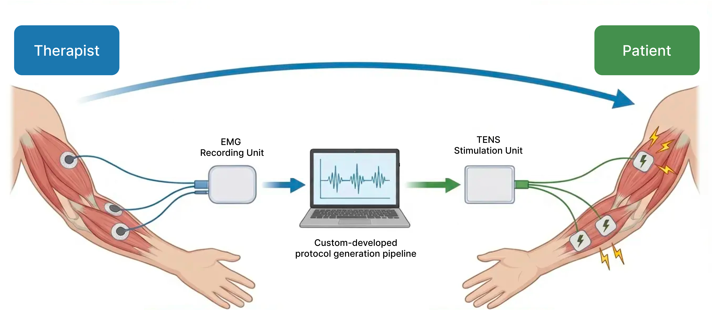
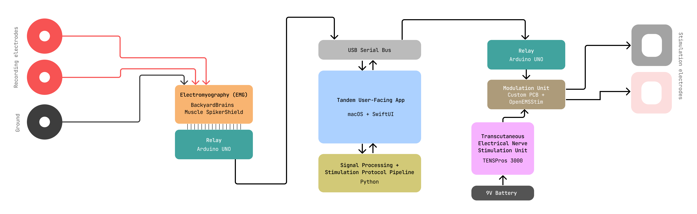
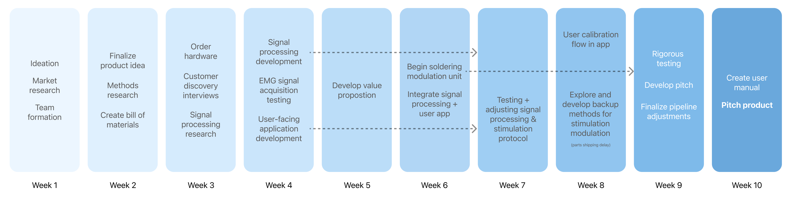

# ⚡️Tandem

Tandem is a physical human-to-human interface that allows for real-time naturalistic translation of motor movements between two people, tailored to physical therapy contexts both in the clinic and at distance.

## The problem

In a typical physical therapy session, the patient and therapist work together closely, with rehabilitation exercises communicated both verbally and with hands-on corrections. But if you're someone who experiences a language barrier with your therapist or you are not able to access in-person physical therapy, this makes it much more difficult to learn and correctly adhere to your rehabilitation program, because you miss out on this tailored feedback.

## How it works

Tandem is easy to use: the therapist, or source person, will place EMG recording electrodes on the target muscle group, and the patient or receiving person, will place TENS stimulation electrodes in an analogous position. (_Shown above is an example use case for an exercise involving the bicep muscles, but Tandem will work with any muscle group based on electrode placement_) The recording unit and the stimulation unit are connected to a central custom-developed macOS application, and after being guided through the calibration process, any movement from the therapist's muscles will be processed, normalized and translated to the patient's muscles by electrical stimulation.

## System design

This project was developed under a $400 budget constraint, using a commercially-available electromyography (EMG) board, BackyardBrains Muscle SpikerShield, and transcutaneous electrical nerve stimulation (TENS) unit, TENSPros 3000. The interface between these components, desktop application, signal processing pipeline, and modulation of TENS amplitude was all custom-developed.

#### ⚠️ Note
The current setup shows a fully wired setup where the stimulation and recording units must be plugged in with a cable to the app due to time constraints, but we hope to expand in the future to adding a WiFi module to both relay Arduino units to extend this interface to remote health settings where both users do not have to use one computer, and the signals are sent wirelessly in real time.

## User-facing application
We custom developed a native macOS application serving as the user-facing software of Tandem. This app guides users through visual electrode placement, calibration to increase accuracy, and has controls for adjusting the stimulation experience during a session. The desktop app also is responsible for the backend of our interface, managing the serial connections to the physical stimulation and recording units and running the signal processing and protocol generation pipelines.

## Live demo

## Timeline

## Acknowledgements

This project was built as part of the 10-week University of Washington Neural Engineering Capstone (BIOEN/EE 461/561) 

By Sasha B, Sebastian H, Anya G, and Ani R.
